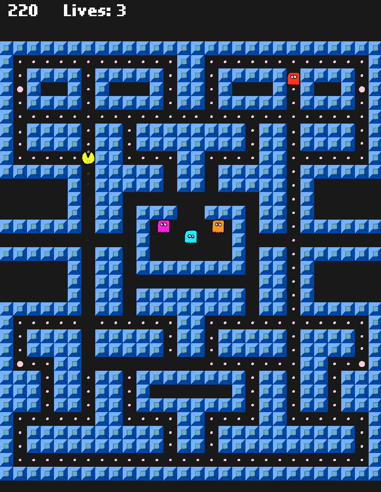

# HaxeFlixel-Pac-Man
Pacman remake in HaxeFlixel

## Licensing
The majority of this project is licensed under the terms of the [GNU GPL v3](https://github.com/joshuaDeal/HaxeFlixel-Pac-Man/blob/main/LICENSE) with the exception of [BigMoverPathfinder.hx](https://github.com/joshuaDeal/HaxeFlixel-Pac-Man/blob/main/source/BigMoverPathfinder.hx), which is sourced from another project and licensed under the terms of the [MIT License](https://github.com/HaxeFlixel/flixel-demos/blob/487ce2c71fbb9652d5ddcc896a5cb4c5377d99bc/LICENSE.md). (More information about that file, its license, and its origin can be found in the comment lines at the start of said file.) Also, the sound effects (Which are currently placeholders) are sourced from [kenney.nl](https://kenney.nl) and were licensed via the [Creative Commons 0 license](https://creativecommons.org/publicdomain/zero/1.0/).

## Unfinished
I haven't quite finished this game, but the main game loop and logic is all there. It's totally playable and still pretty fun.

### TODO
<ul>
	<li>Graphics</li>
		<ul>
			<li><s>Upscale everything (Square sprites should be something like 128x128 or 64x64)</s></li>
			<li>Create sprite sheets / Animations</li>
				<ul>
					<li><s>Player / Pacman</s></li>
					<li><s>Ghosts</s></li>
					<li>Dots</li>
					<li>Fruits</li>
				</ul>
			<li>Create or find better tiles for tilemap</li>
			<li>Add graphics to main menu</li>
			<li>Make hud look nicer</li>
			<li>Make game over screen look nicer</li>
		</ul>
	<li>Game progression logic (what changes between stages) should be more thought out.</li>
	<li>Bugs</li>
		<ul>
			<li>Find and fix any bugs</li>
			<li>Bug with ghosts not moving or not being correctly placed inside pen when in pen mode</li>
			<li>Fruit will sometimes fail to disappear after begin ate</li>
		</ul>
	<li>Sound</li>
		<ul>
			<li>Current sounds are all placeholders</li>
		</ul>
	<li>Mobile device friendly touch controls / input</li>
	<li>Main Menu</li>
		<ul>
			<li>Maybe add a settings screen where the user can toggle things relating to graphics and sound effects. Things that turning on/off could improve performance on weaker devices</li>
		</ul>
	<li>Polish</li>
		<ul>
			<li>Trail effect when ghosts are in flee mode</li>
			<li>Animation for characters switching direction</li>
			<li>Animation for when player is ate by a ghost</li>
			<li>Transition effects between stages</li>
			<li>Cutscene / Cartoons that play between some stages</li>
			<li>Animate dots</li>
				<ul>
					<li>I want the dots to bounce up and down slightly</li>
						<ul>
							<li>The timing of this motion should be offset based on the x positioning of the dot in order to create a wave effect. (Hopefully implementing this won't be too resource intensive)</li>
						</ul>
				</ul>
		</ul>
	<li>Finish TODO list</li>
		<ul>
			<li>Add more items to this list as I start to remember them</li>
		</ul>
</ul>
